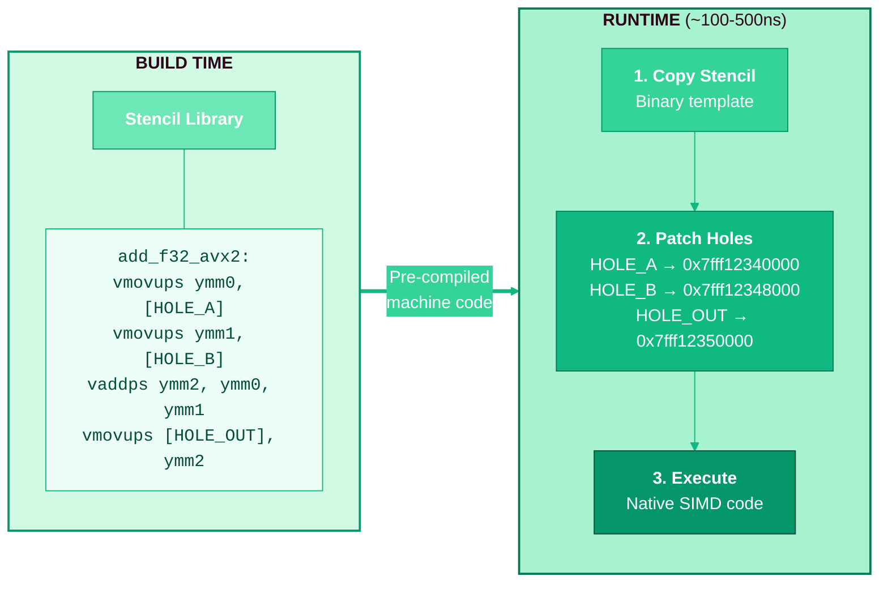
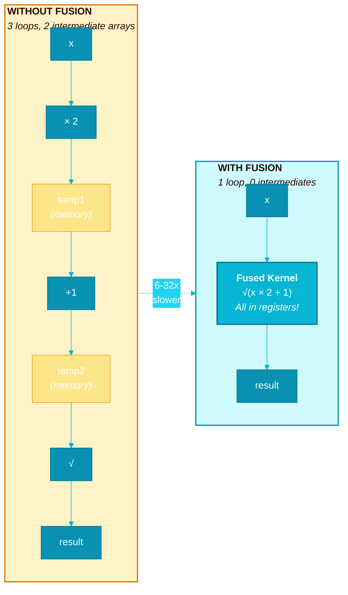
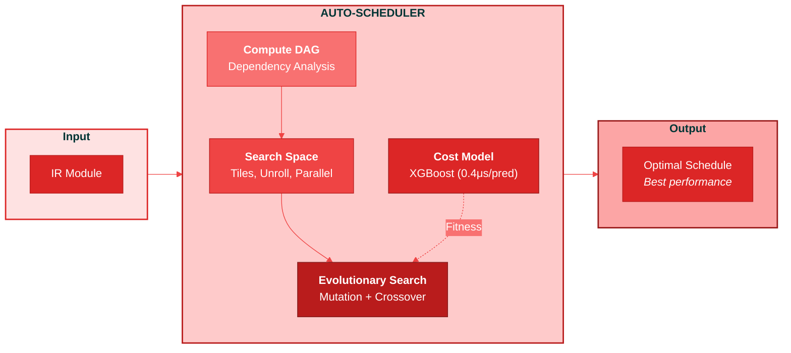
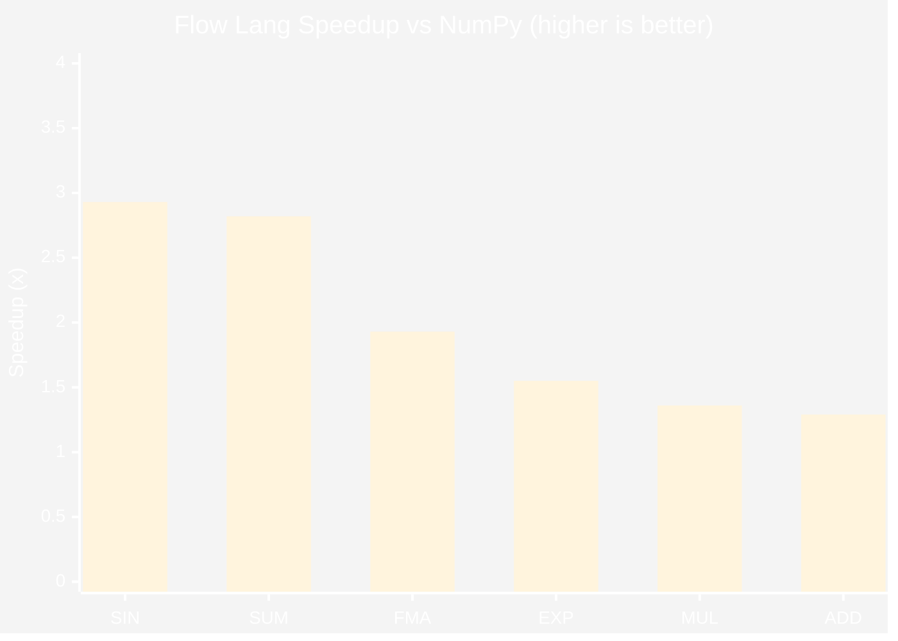
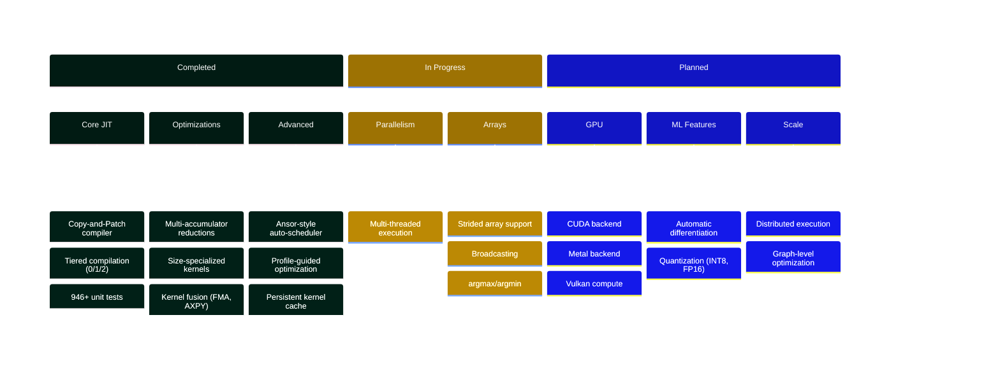

<div align="center">

# Bud Flow Lang

### *SIMD Made Simple*

**A Domain-Specific Language embedded in Python for effortless SIMD kernel creation**

[](https://github.com/BudEcosystem/Bud-Flow-Lang/actions)
[](LICENSE)
[](https://isocpp.org/)
[](https://python.org)
[](#testing)

[Getting Started](#getting-started) · [Documentation](#documentation) · [Examples](#detailed-examples) · [Performance](#performance) · [Contributing](#contributing)

</div>

---

## What is Bud Flow Lang?

**Bud Flow Lang** is a high-performance Domain-Specific Language (DSL) seamlessly embedded within Python, enabling developers to create lightning-fast SIMD kernels without leaving the Python ecosystem. By combining a familiar Pythonic API with cutting-edge JIT compilation technology, Flow Lang delivers **2-4x speedups over NumPy** while maintaining code that reads like standard Python.

```python
import bud_flow_lang_py as flow

flow.initialize()

# Your NumPy-like code automatically becomes SIMD-optimized
x = flow.arange(1_000_000)
y = flow.ones(1_000_000) * 2.0

# Operations are lazily evaluated and fused into a single optimized kernel
result = (x * y + 1).sqrt()  # One fused SIMD kernel, not 3 separate loops
```

**No SIMD intrinsics. No assembly. No compromises.**

---

## Why Flow Lang?

| Challenge | Flow Lang Solution |
|-----------|-------------------|
| SIMD programming is complex | Write NumPy-like Python code |
| LLVM compilation is slow (100ms+) | Copy-and-Patch JIT compiles in **~1ms** |
| Different CPUs have different SIMD | Portable across x86, ARM, RISC-V via Highway |
| Memory-bound operations waste bandwidth | Lazy evaluation **fuses operations** automatically |
| Learning curve is steep | Progressive disclosure: start simple, go deep when needed |

---

## Who Is This For?

Bud Flow Lang is designed for three distinct user profiles, each with progressively deeper access to optimization capabilities:

### Beginner: NumPy-Like Simplicity

*"I want faster code without learning SIMD."*

```python
import bud_flow_lang_py as flow

flow.initialize()

# Create arrays just like NumPy
prices = flow.Bunch.from_list([10.5, 20.3, 15.7, 8.2, 12.9])
quantities = flow.Bunch.from_list([100, 50, 75, 200, 150])

# Familiar operations — automatically SIMD-optimized
total_revenue = (prices * quantities).sum()
average_price = prices.mean()
```

**What you get:** 1.3-3x faster than NumPy with zero SIMD knowledge required.

---

### Developer: Performance-Aware Optimization

*"I understand performance and want control over optimizations."*

```python
import bud_flow_lang_py as flow

flow.initialize()

# Enable advanced optimizations
flow.set_tiling_enabled(True)      # Cache-aware computation tiling
flow.set_prefetch_enabled(True)    # Software prefetching for large arrays

# Create large arrays for data processing
sensor_data = flow.Bunch.arange(10_000_000)
calibration = flow.Bunch.full(10_000_000, 1.05)
offset = flow.Bunch.full(10_000_000, 0.02)

# Fused multiply-add: compiles to single FMA instruction
calibrated = sensor_data.fma(calibration, offset)  # sensor_data * calibration + offset

# High-throughput reductions with multi-accumulator optimization
total = calibrated.sum()
variance = ((calibrated - calibrated.mean()) ** 2).mean()

# Inspect hardware capabilities
info = flow.get_hardware_info()
print(f"SIMD Width: {info['simd_width'] * 8}-bit")
print(f"Using: {'AVX-512' if info['has_avx512'] else 'AVX2' if info['has_avx2'] else 'SSE4.2'}")
```

**What you get:** Full control over optimizations, hardware introspection, and FMA operations.

---

### Expert: Direct JIT Kernel Compilation

*"I need custom kernels with maximum performance."*

```python
import bud_flow_lang_py as flow

flow.initialize()

# Define custom JIT-compiled kernels
@flow.kernel(opt_level=3, enable_fusion=True)
def softmax_numerator(x, max_val):
    """Numerator of softmax: exp(x - max)

    Compiles to fused SIMD kernel on first call.
    Subsequent calls dispatch in < 100ns.
    """
    return (x - max_val).exp()

@flow.kernel
def normalize(x, sum_val):
    """Division for normalization"""
    return x / sum_val

# Use kernels in computation
def softmax(x):
    max_val = x.max()
    numerator = softmax_numerator(x, max_val)
    return normalize(numerator, numerator.sum())

# Kernel compilation statistics
stats = flow.get_jit_stats()
print(f"Kernels compiled: {stats['total_compilations']}")
print(f"Avg compile time: {stats['avg_compile_time_us']:.1f} μs")
print(f"Cache hit rate: {stats['cache_hit_rate']:.1%}")
```

**What you get:** Custom JIT kernels, compilation statistics, persistent caching, profile-guided optimization.

---

## Architecture

Flow Lang implements a sophisticated multi-stage compilation pipeline that transforms Python code into optimized native SIMD instructions:

```mermaid
%%{init: {'theme': 'base', 'themeVariables': { 'primaryColor': '#4f46e5', 'primaryTextColor': '#fff', 'primaryBorderColor': '#4338ca', 'lineColor': '#6366f1', 'secondaryColor': '#818cf8', 'tertiaryColor': '#c7d2fe', 'nodeBorder': '#4338ca', 'clusterBkg': '#f5f3ff', 'clusterBorder': '#a5b4fc', 'titleColor': '#1e1b4b'}}}%%
flowchart TB
    subgraph USER["<b>USER CODE</b>"]
        direction LR
        K["@flow.kernel<br/>def compute(x, y):<br/>    return x * y + 1"]
        L["flow.arange(n) + flow.ones(n)<br/><i>Lazy API Usage</i>"]
    end

    subgraph FRONTEND["<b>FRONTEND LAYER</b>"]
        direction LR
        AST["AST<br/>Analyzer"]
        TYPE["Type<br/>Inferrer"]
        IR["IR Builder<br/><i>(SSA Form)</i>"]
        AST --> TYPE --> IR
    end

    subgraph OPT["<b>OPTIMIZATION LAYER</b>"]
        direction TB
        subgraph PASSES[" "]
            direction LR
            DCE["DCE<br/><i>Dead Code</i>"]
            CSE["CSE<br/><i>Common Subexpr</i>"]
            FOLD["Constant<br/>Folding"]
            FUSE["Operation<br/>Fusion"]
        end
        ANSOR["<b>ANSOR-STYLE AUTO-SCHEDULER</b><br/>Compute DAG → Search Space → Cost Model → Evolutionary Search"]
    end

    subgraph TIERED["<b>TIERED COMPILATION</b>"]
        direction TB
        T0["<b>TIER 0: Highway Interpreter</b><br/>• Immediate execution with profiling<br/>• Collects types, branches, iterations"]
        T1["<b>TIER 1: Copy-and-Patch JIT</b> (~1ms)<br/>• Pre-compiled stencils + runtime patching<br/>• 100x faster than LLVM"]
        T2["<b>TIER 2: Fused Optimized Kernels</b><br/>• Full operation fusion<br/>• Profile-guided specialization"]
        T0 -->|"10 calls"| T1 -->|"100 calls"| T2
    end

    subgraph CODEGEN["<b>CODE GENERATION</b>"]
        direction TB
        HWY["<b>GOOGLE HIGHWAY BACKEND</b><br/>Single source → Multiple targets"]
        subgraph TARGETS[" "]
            direction LR
            X86["x86-64<br/><i>SSE4.2 | AVX2 | AVX-512</i>"]
            ARM["ARM64<br/><i>NEON | SVE | SVE2</i>"]
            RISCV["RISC-V<br/><i>RVV</i>"]
            WASM["WebAssembly<br/><i>SIMD128</i>"]
        end
        HWY --- TARGETS
    end

    subgraph RUNTIME["<b>RUNTIME EXECUTION</b>"]
        direction TB
        EXEC["<b>ADAPTIVE EXECUTOR</b><br/>Thompson Sampling (Multi-Armed Bandit)<br/>• Learns optimal tier selection<br/>• Balances exploration vs exploitation"]
        subgraph MEMORY[" "]
            direction LR
            ARENA["Arena Allocator<br/><i>O(1) alloc</i>"]
            CACHE["Cache-Aware<br/>Tiling"]
            NUMA["NUMA-Aware<br/>Placement"]
        end
    end

    USER --> FRONTEND
    FRONTEND --> OPT
    OPT --> TIERED
    TIERED --> CODEGEN
    CODEGEN --> RUNTIME

    style USER fill:#ddd6fe,stroke:#7c3aed,stroke-width:2px
    style FRONTEND fill:#c7d2fe,stroke:#4f46e5,stroke-width:2px
    style OPT fill:#a5b4fc,stroke:#4338ca,stroke-width:2px
    style TIERED fill:#818cf8,stroke:#3730a3,stroke-width:2px,color:#fff
    style CODEGEN fill:#6366f1,stroke:#312e81,stroke-width:2px,color:#fff
    style RUNTIME fill:#4f46e5,stroke:#1e1b4b,stroke-width:2px,color:#fff
```



### Core Components

| Component | Purpose | Key Innovation |
|-----------|---------|----------------|
| **IR Builder** | Constructs SSA-form intermediate representation | Weld-inspired lazy evaluation enables fusion |
| **Type Inferrer** | Automatic type deduction and propagation | Monomorphic fast-path specialization |
| **Copy-and-Patch JIT** | Sub-millisecond compilation | Pre-compiled stencils with runtime patching |
| **Auto-Scheduler** | Discovers optimal execution schedules | Ansor-style evolutionary search |
| **Adaptive Executor** | Runtime tier selection | Thompson Sampling for self-tuning |
| **Highway Backend** | Portable SIMD code generation | Single source for all architectures |

---

## Compiler Features

### Copy-and-Patch JIT: 100x Faster Than LLVM

Traditional JIT compilers like LLVM are powerful but slow (100ms+ per kernel). Flow Lang's **Copy-and-Patch JIT** achieves **~1ms compilation** by:

1. **Pre-compiling stencils at build time** — Each operation (add, mul, exp, etc.) has pre-compiled machine code templates with "holes"
2. **Runtime patching** — At JIT time, simply copy the stencil and patch in actual memory addresses
3. **No optimization passes** — The stencils are already optimized; no runtime analysis needed



### Lazy Evaluation & Kernel Fusion

Inspired by Stanford's Weld project, Flow Lang defers execution to discover fusion opportunities:



```python
# Without fusion: 3 loops, 2 intermediate arrays, 3x memory traffic
temp1 = x * 2        # Loop 1: Read x, write temp1
temp2 = temp1 + 1    # Loop 2: Read temp1, write temp2
result = sqrt(temp2) # Loop 3: Read temp2, write result

# With Flow Lang fusion: 1 loop, 0 intermediate arrays
result = (flow(x) * 2 + 1).sqrt()

# Generates single fused kernel:
# for i in 0..n:
#     result[i] = sqrt(x[i] * 2 + 1)
```

**Fusion benefits:**
- **6-32x speedups** for memory-bound operations
- Intermediate values stay in registers (not memory)
- Reduced memory bandwidth pressure
- Better cache utilization

### Ansor-Style Auto-Scheduler

Flow Lang includes an auto-scheduler inspired by TVM's Ansor (OSDI 2020) that automatically discovers optimal execution schedules:



```python
from bud_flow_lang import AutoScheduler

# Auto-tune a computation graph
scheduler = AutoScheduler(
    population_size=64,    # Candidates per generation
    num_generations=20,    # Evolutionary iterations
    cost_model='xgboost'   # ML-based performance prediction
)

# Find optimal schedule
result = scheduler.tune(ir_module, time_budget_seconds=10)

print(f"Speedup achieved: {result.speedup:.2f}x")
print(f"Best schedule: {result.best_schedule}")
```

**Auto-scheduler components:**
- **Compute DAG** — Analyzes operation dependencies for fusion opportunities
- **Search Space** — Hierarchical sketch + annotation space (tiles, unroll, parallel)
- **Cost Model** — XGBoost-based runtime prediction (0.4μs per evaluation)
- **Evolutionary Search** — Genetic algorithm with mutation/crossover

### Dynamic Tier Thresholds

JIT compilation thresholds automatically adapt to array size:

| Array Size | JIT Threshold | Rationale |
|------------|---------------|-----------|
| Small (< 256) | 50 calls | Amortize compile cost over many invocations |
| Medium (256-4K) | 10 calls | Standard threshold |
| Large (> 4K) | 3 calls | Immediate benefit from SIMD |

### Profile-Guided Optimization (PGO)

The PGO system collects runtime profiles and specializes hot paths:

1. **Type profiling** — Tracks observed types at each operation
2. **Speculation** — Generates optimized code for monomorphic (single-type) sites
3. **Guards** — Checks assumptions; deoptimizes if violated
4. **Persistence** — Saves profiles to disk for warm-start optimization

---

## Performance

### Benchmark Results

Benchmarked on Intel Core i7-10700KF @ 3.80GHz with AVX2 (256-bit SIMD):



| Operation | vs NumPy | vs JAX | Array Size | Notes |
|-----------|:--------:|:------:|:----------:|-------|
| **SIN** | **2.93x** | **4.2x** | 1M | Highway SIMD transcendentals |
| **SUM** | **2.82x** | **3.4x** | 1M | Multi-accumulator reductions |
| **FMA** | **1.93x** | **2.3x** | 1M | Fused multiply-add instruction |
| **EXP** | **1.55x** | **1.2x** | 1M | Vectorized exponential |
| **MUL** | **1.36x** | **1.5x** | 1M | SIMD multiplication |
| **ADD** | **1.29x** | **2.1x** | 1M | SIMD addition |
| **Fused ops** | **6-32x** | — | 1M | Multi-operation fusion |

### Why Is It Fast?

#### Multi-Accumulator Reductions

Standard reductions have a 4-cycle dependency chain per element. Flow Lang uses 4 independent accumulators:

```cpp
// Standard (latency-bound): ~4 cycles per element
for (i = 0; i < n; i++)
    sum += a[i];  // Must wait for previous add to complete

// Flow Lang (throughput-optimized): ~1 cycle per element
for (i = 0; i < n; i += 4 * LANES) {
    sum0 += a[i];              // Independent
    sum1 += a[i + LANES];      // Independent
    sum2 += a[i + 2*LANES];    // Independent
    sum3 += a[i + 3*LANES];    // Independent (all can execute in parallel)
}
result = sum0 + sum1 + sum2 + sum3;  // Final reduction
```

**Result:** 2-4x speedup on reductions.

#### Size-Specialized Kernels

Different array sizes get different optimizations:

| Size | Strategy | Optimization |
|------|----------|--------------|
| Small (< 256) | Fully unrolled | Zero loop overhead |
| Medium (256-4K) | 4x unroll | Good instruction-level parallelism |
| Large (> 4K) | 8x unroll + prefetch | Hides memory latency |

#### Kernel Fusion

```python
# This expression:
result = (x * scale + bias).relu().sqrt()

# Compiles to one loop (not four):
for i in 0..n:
    temp = x[i] * scale + bias    # FMA instruction
    temp = max(temp, 0)           # ReLU
    result[i] = sqrt(temp)        # All in registers!
```

---

## Benefits

### For Data Scientists & ML Engineers

- **Drop-in NumPy replacement** — Familiar API, faster execution
- **Automatic optimization** — No manual SIMD tuning required
- **Quick iteration** — Sub-millisecond JIT enables interactive development
- **Production-ready** — 946+ tests, comprehensive error handling

### For Systems Programmers

- **Portable SIMD** — One codebase for x86, ARM, RISC-V
- **Predictable performance** — No GC pauses, arena allocators
- **Full control** — Direct kernel definitions when needed
- **C++ integration** — Header-only C++ API available

### For Organizations

- **Reduced compute costs** — 2-4x speedup means 2-4x less hardware
- **Cross-platform deployment** — Same code runs optimally everywhere
- **Future-proof** — Highway supports emerging architectures (SVE2, RVV)
- **Open source** — Apache 2.0 license

---

## Design Philosophy

### 1. Progressive Disclosure

Complexity is revealed only when needed:


### 2. Language Follows Mental Model

Python developers think in arrays and transformations, not registers and lanes. Flow Lang's API mirrors this:

```python
# Mental model: "multiply each element by 2 and add 1"
# Code: Exactly that
result = x * 2 + 1
```

### 3. Compilation Speed Enables Iteration

Traditional JIT (100ms+) breaks interactive workflows. Copy-and-Patch (~1ms) maintains Python's REPL feel while delivering native performance.

### 4. Speculation Enables Optimization

Monomorphic code (same types always) gets aggressive optimization. Type guards ensure correctness with fast deoptimization paths.

### 5. Lazy Evaluation Enables Fusion

By deferring execution, Flow Lang sees the full computation graph and can fuse operations that would otherwise require separate memory passes.

### Inspirations

| Technique | Origin | Flow Lang Implementation |
|-----------|--------|-------------------------|
| Tiered compilation | V8, HotSpot JVM | 3-tier system with adaptive promotion |
| Copy-and-Patch JIT | CPython PEP 744 | Pre-compiled stencils with runtime patching |
| Lazy evaluation | Stanford Weld | Expression graphs for maximum fusion |
| Thompson Sampling | .NET Dynamic PGO | Multi-armed bandit for tier selection |
| Portable SIMD | Google Highway | Single source, all architectures |
| Arena allocators | Game engines | O(1) allocation, bulk deallocation |
| Auto-scheduling | TVM Ansor | Evolutionary search with cost model |

---

## Getting Started

### Prerequisites

- **Operating System:** Linux (Ubuntu 20.04+), macOS (11+), or Windows (10+)
- **Python:** 3.8 or higher
- **C++ Compiler:** GCC 10+, Clang 12+, or MSVC 2019+
- **CMake:** 3.16 or higher
- **Memory:** 4GB+ RAM recommended

### Quick Install

```bash
# Clone the repository
git clone https://github.com/BudEcosystem/Bud-Flow-Lang.git
cd Bud-Flow-Lang/bud_flow_lang

# Create and activate Python virtual environment
python -m venv .venv
source .venv/bin/activate  # On Windows: .venv\Scripts\activate

# Build with Python bindings
mkdir build && cd build
cmake .. -DCMAKE_BUILD_TYPE=Release -DBUD_BUILD_PYTHON=ON
make -j$(nproc)  # On macOS: make -j$(sysctl -n hw.ncpu)

# Verify installation
cd ..
python -c "import bud_flow_lang_py as flow; flow.initialize(); print('Flow Lang ready!')"
```

### Your First Program

```python
import bud_flow_lang_py as flow

# Initialize the runtime
flow.initialize()

# Check hardware capabilities
info = flow.get_hardware_info()
print(f"Detected: {info['arch_family']}")
print(f"SIMD Width: {info['simd_width'] * 8}-bit")

# Create arrays
x = flow.Bunch.arange(1000)
y = flow.Bunch.ones(1000) * 2.0

# Compute with automatic SIMD optimization
result = x + y
print(f"Sum of result: {result.sum()}")

# Clean up
flow.shutdown()
```

---

## Setup

### Build Options

| Option | Default | Description |
|--------|:-------:|-------------|
| `CMAKE_BUILD_TYPE` | Release | Build type: `Debug`, `Release`, `RelWithDebInfo` |
| `BUD_BUILD_PYTHON` | OFF | Build Python bindings (nanobind) |
| `BUD_BUILD_TESTS` | ON | Build 946+ unit tests |
| `BUD_BUILD_BENCHMARKS` | ON | Build performance benchmarks |
| `BUD_ENABLE_SANITIZERS` | OFF | Enable AddressSanitizer and UBSan |
| `BUD_ENABLE_COVERAGE` | OFF | Enable code coverage reporting |
| `BUD_ENABLE_LTO` | OFF | Enable Link-Time Optimization |

### Build Configurations

```bash
# Development build (with debug symbols)
cmake .. -DCMAKE_BUILD_TYPE=Debug -DBUD_BUILD_PYTHON=ON

# Release build (maximum performance)
cmake .. -DCMAKE_BUILD_TYPE=Release -DBUD_BUILD_PYTHON=ON -DBUD_ENABLE_LTO=ON

# Build with sanitizers (for testing)
cmake .. -DCMAKE_BUILD_TYPE=Debug -DBUD_ENABLE_SANITIZERS=ON

# Build without Python bindings (C++ only)
cmake .. -DCMAKE_BUILD_TYPE=Release -DBUD_BUILD_PYTHON=OFF
```

### Dependencies

All dependencies are automatically fetched via CMake's FetchContent:

| Dependency | Version | Purpose |
|------------|---------|---------|
| Google Highway | Latest | Portable SIMD abstraction |
| nanobind | 2.2.0 | Python bindings (4x faster than pybind11) |
| Google Test | Latest | Unit testing framework |
| nanobench | Latest | Micro-benchmarking |
| spdlog | Latest | Structured logging |
| fmt | Latest | String formatting |
| nlohmann/json | Latest | Configuration and IR serialization |

### Running Tests

```bash
cd build

# Run all 946+ tests
./bud_tests

# Run specific test suites
./bud_tests --gtest_filter="DynamicThreshold*"    # Tier threshold tests
./bud_tests --gtest_filter="OptimizedReductions*" # Reduction tests
./bud_tests --gtest_filter="AutoScheduler*"       # Auto-scheduler tests
./bud_tests --gtest_filter="CopyAndPatch*"        # JIT compiler tests

# Run with verbose output
./bud_tests --gtest_print_time=1

# Run Python integration tests
cd ..
python -m pytest tests/python/ -v
```

### Running Benchmarks

```bash
# Quick benchmark
python benchmarks/python/quick_bench.py

# Full benchmark suite with multiple sizes
python benchmarks/python/run_benchmarks.py \
    --sizes 1000,100000,1000000 \
    --runs 20 \
    --compare-numpy \
    --compare-jax

# C++ benchmarks
cd build
./bud_benchmarks
```

---

## Detailed Examples

### Example 1: Signal Processing

```python
import bud_flow_lang_py as flow
import numpy as np

flow.initialize()

# Generate noisy signal
np.random.seed(42)
t = np.linspace(0, 1, 10000)
clean_signal = np.sin(2 * np.pi * 50 * t) + 0.5 * np.sin(2 * np.pi * 120 * t)
noise = np.random.normal(0, 0.5, len(t))
noisy_signal = clean_signal + noise

# Convert to Flow Lang
signal = flow.Bunch.from_numpy(noisy_signal.astype(np.float32))

# Simple moving average filter (window size 5)
# In production, use specialized filter functions
window_size = 5
smoothed = signal  # Placeholder for actual convolution

# Compute signal statistics
mean_val = signal.mean()
std_val = ((signal - mean_val) ** 2).mean().sqrt()  # Standard deviation
max_val = signal.max()
min_val = signal.min()

print(f"Signal Statistics:")
print(f"  Mean: {mean_val:.4f}")
print(f"  Std:  {std_val:.4f}")
print(f"  Range: [{min_val:.4f}, {max_val:.4f}]")

# Normalize signal to [-1, 1]
normalized = (signal - mean_val) / std_val

# RMS (Root Mean Square)
rms = (signal ** 2).mean().sqrt()
print(f"  RMS:  {rms:.4f}")

flow.shutdown()
```

### Example 2: Machine Learning Operations

```python
import bud_flow_lang_py as flow
import numpy as np

flow.initialize()

# Softmax implementation
def softmax(x):
    """Numerically stable softmax"""
    max_val = x.max()
    exp_x = (x - max_val).exp()
    return exp_x / exp_x.sum()

# Create logits
np.random.seed(42)
logits_np = np.random.randn(1000).astype(np.float32)
logits = flow.Bunch.from_numpy(logits_np)

# Compute softmax probabilities
probs = softmax(logits)
print(f"Probabilities sum: {probs.sum():.6f}")  # Should be ~1.0

# Cross-entropy loss
targets = flow.Bunch.zeros(1000)
# Assuming class 42 is the correct class
# loss = -log(probs[42])  # Simplified

# Batch normalization parameters
gamma = flow.Bunch.ones(1000)
beta = flow.Bunch.zeros(1000)
epsilon = 1e-5

# Batch norm: (x - mean) / sqrt(var + eps) * gamma + beta
mean = logits.mean()
variance = ((logits - mean) ** 2).mean()
normalized = (logits - mean) / (variance + epsilon).sqrt()
output = normalized.fma(gamma, beta)  # gamma * normalized + beta

print(f"Normalized mean: {output.mean():.6f}")  # Should be ~0
print(f"Normalized var:  {((output - output.mean()) ** 2).mean():.6f}")  # Should be ~1

flow.shutdown()
```

### Example 3: Financial Calculations

```python
import bud_flow_lang_py as flow
import numpy as np

flow.initialize()

# Portfolio returns calculation
np.random.seed(42)
n_assets = 100
n_days = 252  # Trading days in a year

# Generate random daily returns
returns_np = np.random.randn(n_assets).astype(np.float32) * 0.02  # 2% daily vol

# Portfolio weights (equal-weighted)
weights_np = np.ones(n_assets, dtype=np.float32) / n_assets

# Convert to Flow Lang
returns = flow.Bunch.from_numpy(returns_np)
weights = flow.Bunch.from_numpy(weights_np)

# Portfolio return (dot product)
portfolio_return = returns.dot(weights)
print(f"Portfolio daily return: {portfolio_return * 100:.4f}%")

# Annualized return
annualized = portfolio_return * np.sqrt(252)
print(f"Annualized return: {annualized * 100:.2f}%")

# Risk metrics
volatility = ((returns - returns.mean()) ** 2).mean().sqrt()
print(f"Daily volatility: {volatility * 100:.4f}%")

# Sharpe ratio (assuming 0 risk-free rate)
sharpe = portfolio_return / volatility if volatility > 0 else 0
print(f"Sharpe ratio: {sharpe:.4f}")

# Value at Risk (VaR) - simplified parametric
# Assuming normal distribution: VaR_95 = mean - 1.645 * std
var_95 = returns.mean() - 1.645 * volatility
print(f"95% VaR: {var_95 * 100:.4f}%")

flow.shutdown()
```

### Example 4: Image Processing Kernels

```python
import bud_flow_lang_py as flow
import numpy as np

flow.initialize()

# Simulate grayscale image as 1D array (flattened)
np.random.seed(42)
width, height = 1920, 1080
image_np = np.random.randint(0, 256, width * height).astype(np.float32)

image = flow.Bunch.from_numpy(image_np)

# Brightness adjustment
brightness_factor = 1.2
brightened = (image * brightness_factor).min_with_scalar(255.0)

# Contrast adjustment
mean_intensity = image.mean()
contrast_factor = 1.5
contrasted = (image - mean_intensity).fma(
    flow.Bunch.full(len(image_np), contrast_factor),
    flow.Bunch.full(len(image_np), mean_intensity)
)

# Gamma correction: output = input^gamma
gamma = 2.2
# Note: For proper gamma correction, normalize to [0,1], apply power, denormalize
normalized = image / 255.0
gamma_corrected = (normalized.log() * gamma).exp() * 255.0

# Image statistics
print(f"Image Statistics:")
print(f"  Min intensity: {image.min():.1f}")
print(f"  Max intensity: {image.max():.1f}")
print(f"  Mean intensity: {image.mean():.1f}")
print(f"  Pixels processed: {len(image_np):,}")

flow.shutdown()
```

### Example 5: Custom JIT Kernels

```python
import bud_flow_lang_py as flow
import numpy as np

flow.initialize()

# Define custom kernels with the @flow.kernel decorator
@flow.kernel(opt_level=3, enable_fusion=True)
def gelu(x):
    """Gaussian Error Linear Unit activation

    GELU(x) = x * 0.5 * (1 + tanh(sqrt(2/pi) * (x + 0.044715 * x^3)))

    Simplified approximation used here for demonstration.
    """
    return x * (x.tanh() + 1) * 0.5

@flow.kernel
def swish(x, beta=1.0):
    """Swish activation: x * sigmoid(beta * x)"""
    return x * (1.0 / (1.0 + (-x * beta).exp()))

@flow.kernel
def layer_norm_stats(x):
    """Compute mean and variance for layer normalization"""
    mean = x.mean()
    var = ((x - mean) ** 2).mean()
    return mean, var

# Test custom kernels
np.random.seed(42)
x_np = np.random.randn(10000).astype(np.float32)
x = flow.Bunch.from_numpy(x_np)

# First call compiles (~1ms), subsequent calls use cached kernel
gelu_out = gelu(x)
swish_out = swish(x, beta=1.0)

print(f"GELU output range: [{gelu_out.min():.4f}, {gelu_out.max():.4f}]")
print(f"Swish output range: [{swish_out.min():.4f}, {swish_out.max():.4f}]")

# Check JIT statistics
stats = flow.get_jit_stats()
print(f"\nJIT Statistics:")
print(f"  Total compilations: {stats['total_compilations']}")
print(f"  Average compile time: {stats['avg_compile_time_us']:.1f} μs")
print(f"  Cache hit rate: {stats['cache_hit_rate']:.1%}")

flow.shutdown()
```

### Example 6: C++ Integration

```cpp
#include <bud_flow_lang/bud_flow_lang.h>
#include <iostream>

int main() {
    // Initialize with configuration
    bud::RuntimeConfig config;
    config.enable_debug_output = false;
    config.enable_profiling = true;
    config.tier1_threshold = 10;
    config.tier2_threshold = 100;

    if (auto err = bud::initialize(config); !err.ok()) {
        std::cerr << "Initialization failed: " << err.message() << "\n";
        return 1;
    }

    // Create arrays
    auto a = bud::Bunch::arange(1000000).value();
    auto b = bud::Bunch::fill(1000000, 2.0f).value();
    auto c = bud::Bunch::fill(1000000, 1.0f).value();

    // Element-wise operations
    auto sum = a + b;
    auto product = a * b;

    // Fused multiply-add (single FMA instruction)
    auto fma_result = a.fma(b, c);  // a * b + c

    // Reductions
    float total = a.sum();
    float dot_product = a.dot(b);
    float mean = a.mean();

    std::cout << "Total: " << total << "\n";
    std::cout << "Dot product: " << dot_product << "\n";
    std::cout << "Mean: " << mean << "\n";

    // Transcendental functions
    auto sqrt_a = a.sqrt();
    auto exp_a = (a / 1000000.0f).exp();  // Scale down to avoid overflow
    auto sin_a = a.sin();

    // Get JIT statistics
    auto stats = bud::jit::getJitStats();
    std::cout << "\nJIT Statistics:\n";
    std::cout << "  Compilations: " << stats.total_compilations << "\n";
    std::cout << "  Total time: " << stats.total_compile_time_us << " μs\n";
    std::cout << "  Cache hits: " << stats.cache_hits << "\n";

    // Get hardware information
    auto hw_info = bud::getHardwareInfo();
    std::cout << "\nHardware:\n";
    std::cout << "  SIMD Width: " << (hw_info.simd_width * 8) << " bits\n";
    std::cout << "  AVX-512: " << (hw_info.has_avx512 ? "Yes" : "No") << "\n";
    std::cout << "  Cores: " << hw_info.physical_cores << "\n";

    bud::shutdown();
    return 0;
}
```

---

## Documentation

| Document | Description |
|----------|-------------|
| [Getting Started](docs/getting_started.md) | 5-minute introduction to Flow Lang |
| [Installation Guide](docs/installation.md) | Detailed setup instructions |
| [Python API Reference](docs/python_api.md) | Complete Python bindings documentation |
| [C++ API Reference](docs/cpp_api.md) | Header documentation for C++ users |
| [Performance Guide](docs/performance_guide.md) | Tips for maximum performance |
| [Architecture Deep Dive](docs/architecture.md) | Internal design documentation |
| [Tutorials](docs/tutorials/) | Step-by-step guides for common tasks |

---

## Testing

Flow Lang maintains a comprehensive test suite with **946+ unit tests** covering all components:

| Category | Tests | Coverage |
|----------|:-----:|----------|
| Core IR | 150+ | IR builder, optimizer, SSA form, value types |
| JIT Compiler | 120+ | Copy-and-patch, stencils, fusion, tiers |
| Code Generation | 180+ | Highway SIMD operations, multi-target |
| Runtime | 100+ | Executor, Bunch operations, tiered dispatch |
| Auto-Scheduler | 81 | Evolutionary search, cost model, DAG |
| Memory | 50+ | Arena allocator, prefetch, cache config |
| Python Bindings | 80+ | API coverage, NumPy interop, error handling |

### Test Infrastructure

- **Google Test (gtest)** — C++ unit testing framework
- **Differential testing** — Compare output against NumPy reference
- **Fuzz testing** — libFuzzer for IR parsing and code generation
- **Sanitizer support** — ASan, UBSan, TSan, MSan in CI

---

## Roadmap



### Completed

- [x] Copy-and-Patch JIT compiler
- [x] Tiered compilation system (Tier 0/1/2)
- [x] Multi-accumulator reductions
- [x] Size-specialized kernels
- [x] Kernel fusion (FMA, AXPY, compound ops)
- [x] Software prefetching
- [x] Dynamic tier thresholds
- [x] Cost model-based fusion decisions
- [x] Multi-output fusion
- [x] Persistent kernel cache
- [x] Profile-guided optimization
- [x] Ansor-style auto-scheduler
- [x] Adaptive execution (Thompson Sampling)
- [x] Python bindings (nanobind)
- [x] 946+ unit tests

### In Progress

- [ ] Multi-threaded execution (per-core tier promotion)
- [ ] Strided array support
- [ ] Broadcasting for different shapes
- [ ] Additional reduction operations (argmax, argmin)

### Planned

- [ ] GPU backend (CUDA, Metal, Vulkan compute)
- [ ] Automatic differentiation (backward pass generation)
- [ ] Graph-level optimization (cross-kernel fusion)
- [ ] Distributed execution (MPI, NCCL)
- [ ] Custom operator registration API
- [ ] Quantization support (INT8, FP16)
- [ ] Sparse array operations

---

## Contributing

We welcome contributions! Please follow these guidelines:

1. **Fork & Clone** the repository
2. **Create a feature branch** from `main`
3. **Write tests** for new functionality
4. **Ensure all tests pass:** `./bud_tests`
5. **Format code:** `clang-format -i src/**/*.cpp include/**/*.h`
6. **Submit a pull request**

### Code Style

- Follow LLVM coding standards
- Use `clang-format` with the provided `.clang-format`
- Run `clang-tidy` before submitting
- Write meaningful commit messages

---

## License

Copyright 2024-2025 Bud Ecosystem Inc.

Licensed under the Apache License, Version 2.0. See [LICENSE](LICENSE) for details.

---

## Acknowledgments

Flow Lang builds upon the excellent work of:

- **[Google Highway](https://github.com/google/highway)** — Portable SIMD abstraction
- **[Stanford Weld](https://cs.stanford.edu/~matei/papers/2017/cidr_weld.pdf)** — Lazy evaluation and fusion
- **[TVM Ansor](https://arxiv.org/abs/2006.06762)** — Auto-scheduling techniques
- **[V8 TurboFan](https://v8.dev/docs/turbofan)** — Tiered compilation inspiration
- **[CPython PEP 744](https://peps.python.org/pep-0744/)** — Copy-and-Patch JIT concepts

---

## Author

**Jithin VG** — [Bud Ecosystem Inc.](https://budecosystem.com)

---

## Links

- [GitHub Repository](https://github.com/BudEcosystem/Bud-Flow-Lang)
- [Issue Tracker](https://github.com/BudEcosystem/Bud-Flow-Lang/issues)
- [Bud Ecosystem](https://budecosystem.com)

---

<div align="center">

**Made with performance in mind**

*SIMD Made Simple*

</div>
